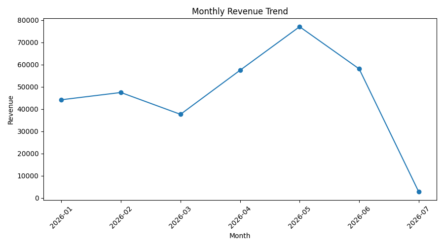

# Retail Sales Analysis

**Name:** Uwaiz Slade Lovell  
**Cohort:** 2026 DS Jan Cohort

## How to Run

Clone the repository and open the project folder in the terminal:

```markdown
```bash
##git clone <https://github.com/UwaizLovell/retail-sales-analysis.git>
##cd retail-sales-analysis
##pip install -r requirements.txt

## Project Overview

This project analyses retail sales data to identify patterns in revenue, product performance, store performance, monthly sales trends, and payment methods.

The analysis includes data cleaning, exploratory analysis, visualisations, and business recommendations based on the cleaned dataset.

The project was completed using Python and pandas, with charts created using matplotlib.

## Business Questions

The analysis aims to answer the following questions:

1. What is the total revenue, total quantity sold, and average transaction value?
2. Which product category generates the most revenue?
3. Which store generates the most revenue?
4. How does revenue change over time?
5. Which products generate the most revenue?
6. Which product sells the most units?
7. What is the most common payment method?

## Dataset

The dataset contains retail sales transactions with information about:

- Date
- Transaction ID
- Product ID
- Product name
- Category
- Store
- Quantity
- Unit price
- Payment method

The original dataset contained 600 rows. After data cleaning, 596 clean rows remained.

## Project Structure

- `analysis.ipynb` - Main analysis notebook containing the data cleaning, analysis, calculations, and visualisations.
- `helpers.py` - Helper functions used to perform reusable calculations.
- `data/sales_data.csv` - Retail sales dataset used for the analysis.
- `charts/` - Contains the generated visualisation images.
- `requirements.txt` - Python libraries required to run the project.
- `README.md` - Project documentation and instructions.

## Data Cleaning

The dataset was checked and cleaned before analysis.

The following data-quality issues were identified and addressed:

- Duplicate rows: 1
- Missing quantity: 1
- Invalid unit price: 1
- Negative quantity: 1

A total of 4 rows were removed, leaving 596 clean rows for analysis.

After cleaning, there were no remaining missing values, no duplicate rows, and no negative quantities.

## Key Findings

### Overall Performance

- Total revenue was **R324,303.00**.
- Total quantity sold was **4,629 units**.
- The average transaction value was **R544.13**.

### Revenue by Category

The **Beverages** category generated the highest revenue at **R109,320.00**, followed by Meat at R104,055.00.

### Revenue by Store

**Sandton** generated the highest revenue at **R89,137.50**. Pretoria generated R84,412.00, Soweto generated R83,569.00, and Rosebank generated R67,184.50.

### Monthly Revenue

**May** recorded the highest monthly revenue at **R77,000.00**. Revenue varied across the months, with July showing only R2,728.00 in the available dataset.

### Product Performance

**Coffee Beans 1kg** generated the highest revenue at **R77,760.00**.

**Rooibos Tea 100g** was the best-selling product by quantity, with **570 units sold**.

### Payment Method

The most common payment method was **Mobile**, with **166 transactions**.

## Visualisation

The chart below shows the monthly revenue trend for the cleaned dataset.



## Recommendations

Based on the analysis, the following recommendations can be considered:

- Maintain strong stock availability for high-performing products, particularly Coffee Beans 1kg and Rooibos Tea 100g.
- Review the performance of the Beverages category and consider opportunities to maintain or increase sales in this category.
- Investigate the factors contributing to Sandton's higher revenue and consider whether successful practices can be applied to other stores.
- Monitor monthly sales patterns and investigate the lower revenue recorded in July.
- Ensure that mobile payment remains available, as Mobile was the most frequently used payment method in the dataset.

## Limitations

- The analysis is based on the available sales transactions in the dataset and may not represent all retail activity.
- The dataset covers a limited period, so longer-term seasonal patterns cannot be confirmed.
- The analysis identifies patterns in the data but does not establish the causes of changes in sales or revenue.
- July contains only a small amount of revenue in the available dataset, so it should be interpreted with caution.

## Tools & Skills

- Python
- pandas
- matplotlib
- Jupyter Notebook
- Data cleaning and validation
- Exploratory data analysis
- Data aggregation and grouping
- Data visualisation
- Git and GitHub
- Python functions and modular code

